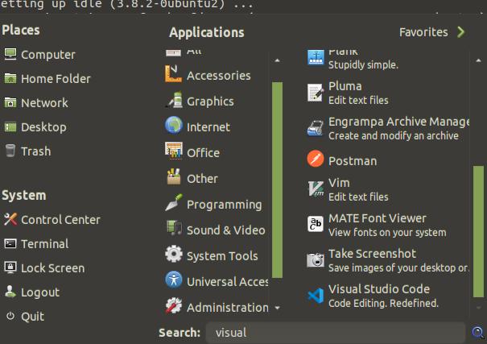
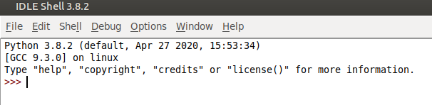
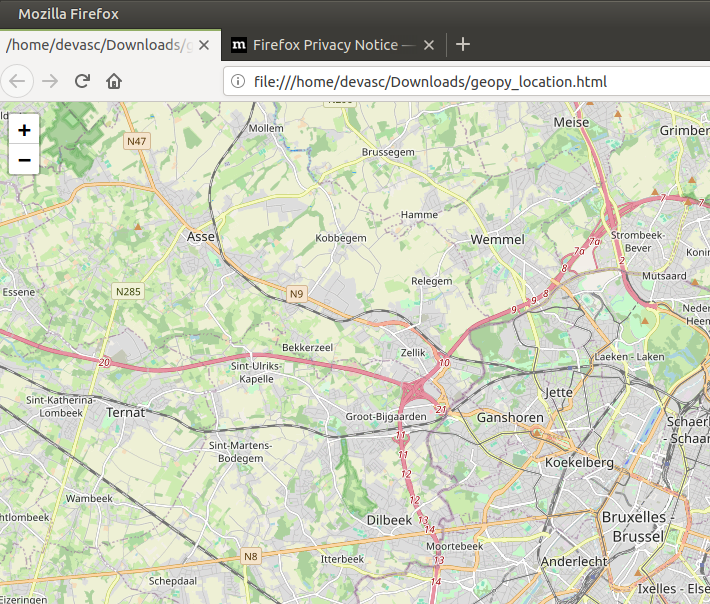

# LAB 1
## 1.1

installatie van:
- Python 3.8 en PIP
- Visual Studio Code
- Jupyter Notebook
- Python IDLE

controle versie python: 

```bash
devasc@labvm:~$ python3 --version
Python 3.8.2
```
Visual Studio Code was reeds geïnstalleerd.




installatie van pip, Jupyter Notebook & Python IDLE:

```bash
devasc@labvm:~$ sudo apt install python3-pip
devasc@labvm:~$ sudo apt install jupyter-notebook
devasc@labvm:~$ sudo apt install idle
```
Volgens de site kan jupyter notebook ook via pip geïnstalleerd worden (pip install notebook)

Voor installatie kan je controleren wat een package precies is met:
```bash
devasc@labvm:~$ sudo apt show packagename
```

Ik had problemen om idle te starten. Na online opzoekwerk blijkt het te komen door problemen met tk.
```bash
devasc@labvm:~$ sudo apt-get update
devasc@labvm:~$ sudo apt-get remove idle
devasc@labvm:~$ sudo apt-get install idle3
devasc@labvm:~$ sudo apt-get install python3-tk
devasc@labvm:~$ idle
```


Om jupyter notebook te starten:
```bash
devasc@labvm:~$ jupyter notebook
```

## 1.2


### timedate.py:
```python
import datetime

nu = datetime.datetime.now()

morgen = nu + datetime.timedelta(1)

print("Current date and time: ")

print(nu)

print("Time in exactly 1 day:")

print(morgen)
```

Ik heb dit script aangepast. Nu word de huidige tijd eerst in de variabele nu gestoken. Daarna word er via datetime.timedelta 1 dag aan toegevoegd en in de variable morgen gestoken. Daarna worden beide afgeprint.

### geopy-geocoders_location.py

Na het inlezen gezien dat visual basic geopy en folium niet kent. Volgens mij moeten deze dus nog geïnstalleerd worden.

```
devasc@labvm:~$ pip install folium
devasc@labvm:~$ pip install geopy
```

Daarna werkt het script wel.
```
devasc@labvm:~/Downloads$ python3 geopy-geocoders_location.py 
Ville de Bruxelles - Stad Brussel, Brussel-Hoofdstad - Bruxelles-Capitale, Région de Bruxelles-Capitale - Brussels Hoofdstedelijk Gewest, België / Belgique / Belgien
(50.8550018, 4.3512333761166175)
devasc@labvm:~/Downloads$ ls
geopy-geocoders_location.py  geopy_location.html  location.py  response_1709664184411.json  timedate.py
devasc@labvm:~/Downloads$ 
```
geopy_location.html kan geopend worden. Dan krijg je een afbeelding van openstreetmap van de opgegeven locatie.


uitleg code:

Eerst wordt in een variabele (geolocator) het onderdeel 'Nomanitim' onderdeel van geopy.geocoders gestoken.

Daarna wordt in de variable city_country "Brussels, Belgium" weggestoken.

Vervolgens wordt door middel van de variabelen geolocator en city_country de exactle locatie opgevraagd. Daarna worden de latitude en longitutde in variabelen gestoken.

```python
geolocator = Nominatim(user_agent="http://biasc.be")

city_country = "Brussels, Belgium"

location = geolocator.geocode(city_country)

print(location.address)

devnet_lat = location.latitude

devnet_lon = location.longitude

print((devnet_lat, devnet_lon))
```

Het 2e deel is om een map aan te maken. Eerst worden met de latitude en longitude een variable coordinates gemaakt. Daarna wordt d.m.v. folium een map aangemaakt van de locatie die zich in de nieuwe variabele bevind. Ten slotte word die weggeschreven in geopy_location.html)

```python
coordinates = [devnet_lat,devnet_lon]
map = folium.Map(location=coordinates, tiles='OpenStreetMap',  zoom_start=12)
map
# save method of Map object will create a map
# saved in Downloads
map.save("geopy_location.html")
```

### location.py

Dit is praktisch hetzelfde als de vorige, maar dan zonder de map op te vragen en weg te schrijven naar een html-pagina.

## 1.3
installatie python en pip:
Op de site van python de installer afhalen en installeren. Tijdens de installatie ervoor zorgen dat de optie voor environment variable aangezet wordt.

intstallatie jupyter notebook:
```cmd
pip install notebook
jupyter notebook
```

Daarna start jupyter notebook in een browser op.

Bij de installatie van python wordt idle mee geïnstalleerd.

De 3 script werken net zoals in linux. Ook in windows moet je eerst folium en geopy installeren.

```cmd
pip install geopy
pip install folium
```

## 1.4
De devasc omgeving van Cisco is gebaseerd op Ubuntu 20.4. Dit kan je controleren door het commando hieronder:

```bash
devasc@labvm:~$ cat /etc/*-release
DISTRIB_ID=Ubuntu
DISTRIB_RELEASE=20.04
DISTRIB_CODENAME=focal
DISTRIB_DESCRIPTION="Ubuntu 20.04 LTS"
NAME="Ubuntu"
VERSION="20.04 LTS (Focal Fossa)"
ID=ubuntu
ID_LIKE=debian
PRETTY_NAME="Ubuntu 20.04 LTS"
VERSION_ID="20.04"
HOME_URL="https://www.ubuntu.com/"
SUPPORT_URL="https://help.ubuntu.com/"
BUG_REPORT_URL="https://bugs.launchpad.net/ubuntu/"
PRIVACY_POLICY_URL="https://www.ubuntu.com/legal/terms-and-policies/privacy-policy"
VERSION_CODENAME=focal
UBUNTU_CODENAME=focal
```

Het kan zijn dat op een standaard Ubuntu 22.04 je python nog appart moet installeren.
```bash
sudo apt-get install python3
sudo apt-get install python3-pip
sudo apt-get install python3-tk
sudo apt-get install jupyter-notebook
sudo apt-get install idle3
```

Het grote voordeel van Python is dat het systeem onafhankeliljk werkt. Dus code die in Windows werkt zal ook in linux werken.