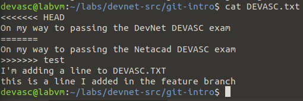
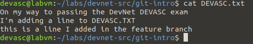

# LAB 5
## Part 1
Cisco DEVNET 3.3.11
### 5.1.1
Launch DEVASC VM

### 5.1.2 Initializing git
```bash
evasc@labvm:~$ git config --global user.name "username"
devasc@labvm:~$ git config --global user.email naam@example.com
devasc@labvm:~$ get config --list

Command 'get' not found, but there are 18 similar ones.

devasc@labvm:~$ git config --list
user.name=username
user.email=naam@example.com
devasc@labvm:~$
```

Daarna maken we een file folder genaamd 'git-intro' aan onder ~/labs/devnet-src. Vervolgens gaan we naar die folder.

Met het 'git init' commando kunnen we de huidige directory initializeren als een git repository.
```bash
evasc@labvm:~/labs/devnet-src$ mkdir git-intro
devasc@labvm:~/labs/devnet-src$ cd git-intro
devasc@labvm:~/labs/devnet-src/git-intro$ git init
Initialized empty Git repository in /home/devasc/labs/devnet-src/git-intro/.git/
devasc@labvm:~/labs/devnet-src/git-intro$ ls -a
.  ..  .git
devasc@labvm:~/labs/devnet-src/git-intro$ git status
On branch master

No commits yet

nothing to commit (create/copy files and use "git add" to track)
```
Als we nu kijken wat er in die folder zit zien we 3 folders. Met 'git status' zien we:
- dat we in de master branch zijn
- commit message = initial commit
- er zijn geen veranderingen. Dus er kan niets gecommit worden.

### 5.1.3 Staging and committing a File in the repository

We maken eerst een file aan. Daarna controleren we met 'git status' of er iets veranderd is.  
```bash
drwxrwxr-x  7 devasc devasc 4096 Mar 19 17:35 .git
devasc@labvm:~/labs/devnet-src/git-intro$ echo "On my way to passing the Cisco DEVASC exam" > DEVASC.txt
devasc@labvm:~/labs/devnet-src/git-intro$ ls -al
total 16
drwxrwxr-x  3 devasc devasc 4096 Mar 19 17:44 .
drwxr-xr-x 15 devasc devasc 4096 Mar 19 17:34 ..
-rw-rw-r--  1 devasc devasc   43 Mar 19 17:44 DEVASC.txt
drwxrwxr-x  7 devasc devasc 4096 Mar 19 17:35 .git
devasc@labvm:~/labs/devnet-src/git-intro$ git status
On branch master

No commits yet

Untracked files:
  (use "git add <file>..." to include in what will be committed)
	DEVASC.txt

nothing added to commit but untracked files present (use "git add" to track)
```
Vooraleer we een commit kunnen doen van de file moeten we hem eerst stagen. dit gebeurd met 'git add filenaam.txt'

Met 'git status' zien we dat de file staat als "to be committed"
```bash
devasc@labvm:~/labs/devnet-src/git-intro$ git add DEVASC.txt 
devasc@labvm:~/labs/devnet-src/git-intro$ git status
On branch master

No commits yet

Changes to be committed:
  (use "git rm --cached <file>..." to unstage)
	new file:   DEVASC.txt
```


Met 'git commit' kunnen we de verandering committen. We geven een boodschap mee met '-m "boodschap"'

```bash
evasc@labvm:~/labs/devnet-src/git-intro$ git commit -m "Committing DEVASC.txt to begin tracking changes"
7[master (root-commit) 0369566] Committing DEVASC.txt to begin tracking changes
 1 file changed, 1 insertion(+)
 create mode 100644 DEVASC.txt
devasc@labvm:~/labs/devnet-src/git-intro$ git status
On branch master
nothing to commit, working tree clean
```

De commit geschiedenis kunnen we bekijken met git log
```bash
devasc@labvm:~/labs/devnet-src/git-intro$ git log
commit 03695666407f35d158baf98648477bbca7447447 (HEAD -> master)
Author: loginnaam <login@example.com>
Date:   Tue Mar 19 17:49:13 2024 +0000

    Committing DEVASC.txt to begin tracking changes
```

### 5.1.4 Modifying the File and Tracking the changes
Eerst veranderen we de file DEVASC.txt en controleren we met cat of hij effectief veranderd is. 

Daarna stagen we de file opnieuw met 'git add' (hetzelfde commando als een nieuwe file uplaoden). Daarna doen we een nieuwe commit. Met 'git status' controleren we of we een commit kunnen doen.

Uiteindelijk controleren we met git log of de nieuwe commit in de log staat.

```bash
evasc@labvm:~/labs/devnet-src/git-intro$ git add DEVASC.txt 
devasc@labvm:~/labs/devnet-src/git-intro$ git status
On branch master
Changes to be committed:
  (use "git restore --staged <file>..." to unstage)
	modified:   DEVASC.txt

devasc@labvm:~/labs/devnet-src/git-intro$ git commit -m "Added additional line to file"
[master 067f9ba] Added additional line to file
 1 file changed, 1 insertion(+)
devasc@labvm:~/labs/devnet-src/git-intro$ git log
commit 067f9ba2fc78d317ce63b2df34df896e9e1cbfba (HEAD -> master)
Author: loginnaam <login@example.com>
Date:   Tue Mar 19 17:57:27 2024 +0000

    Added additional line to file

commit 03695666407f35d158baf98648477bbca7447447
Author: loginnaam <login@example.com>
Date:   Tue Mar 19 17:49:13 2024 +0000

    Committing DEVASC.txt to begin tracking changes
devasc@labvm:~/labs/devnet-src/git-intro
```

We kunnen ook de verschillen zien tussen de verschillende commits. Dit gebeurd met 'git diff'
```git diff
devasc@labvm:~/labs/devnet-src/git-intro$ git diff 067f9ba 03695666407
diff --git a/DEVASC.txt b/DEVASC.txt
index df3da26..ada9722 100644
--- a/DEVASC.txt
+++ b/DEVASC.txt
@@ -1,2 +1 @@
 On my way to passing the Cisco DEVASC exam
-I'm adding a line to DEVASC.TXT
```

### 5.1.5 Branches and Merging
Eerst maken we een nieuwe branch aan, vervolgens controleren we dat die bestaat. Daarna gaan we naar de nieuwe branch.
```bash
devasc@labvm:~/labs/devnet-src/git-intro$ git branch feature
devasc@labvm:~/labs/devnet-src/git-intro$ git branch
  feature
* master
devasc@labvm:~/labs/devnet-src/git-intro$ git checkout feature
Switched to branch 'feature'
devasc@labvm:~/labs/devnet-src/git-intro$ git branch
* feature
  master
devasc@labvm:~/labs/devnet-src/git-intro$ 
```

Daarna voegen we een nieuwe lijn toe aan DEVASC.txt. Daarna stagen we de file opnieuw. met 'git status' controleren we dat er een verandering gestaged is in de feature branch.
```bash
devasc@labvm:~/labs/devnet-src/git-intro$ echo "this is a line I added in the feature branch" >> DEVASC.txt 
devasc@labvm:~/labs/devnet-src/git-intro$ git add DEVASC.txt
devasc@labvm:~/labs/devnet-src/git-intro$ git status
On branch feature
Changes to be committed:
  (use "git restore --staged <file>..." to unstage)
	modified:   DEVASC.tx
```

We doen opnieuw een commit. Met 'git log' zien we de derde commit. Vervolgens gaan we terug naar de master branch.
```bash
devasc@labvm:~/labs/devnet-src/git-intro$ cat DEVASC.txt 
On my way to passing the Cisco DEVASC exam
I'm adding a line to DEVASC.TXT
this is a line I added in the feature branch
devasc@labvm:~/labs/devnet-src/git-intro$ git checkout master
Switched to branch 'master'
devasc@labvm:~/labs/devnet-src/git-intro$ git branch
  feature
* master
devasc@labvm:~/labs/devnet-src/git-intro$ cat DEVASC.txt 
On my way to passing the Cisco DEVASC exam
I'm adding a line to DEVASC.TXT
devasc@labvm:~/labs/devnet-src/git-intro$
```

We gaan nu een merge doen. We zien daarna dat de 3e lijn toegevoegd is en dat we nog steeds in de master branch zitten. We zien ook dat de feature branch nog bestaat.
```
devasc@labvm:~/labs/devnet-src/git-intro$ git merge feature 
Updating 067f9ba..9cce028
Fast-forward
 DEVASC.txt | 1 +
 1 file changed, 1 insertion(+)
devasc@labvm:~/labs/devnet-src/git-intro$ cat DEVASC.txt 
On my way to passing the Cisco DEVASC exam
I'm adding a line to DEVASC.TXT
this is a line I added in the feature branch

devasc@labvm:~/labs/devnet-src/git-intro$ git branch
  feature
* master
```

Nu kunnen we de feature branch verwijderen. Daarna kunnen we met zien dat de branch effectief niet bestaat.
```bash
git branch -d feature
git branch
```

### 5.1.6 Handling merge conflicts
We maken een nieuwe branch aan. Daarna maken we een verandering aan in de DEVASC.txt file. 

Vervolgens doen we een git 'commit -a'. Hierbij stagen we dus niet en committen we onmiddellijk veranderde of verwijderde files.
```bash
git branch test
git checkout test
sed -i 's/Cisco/Netacad/' DEVASC.txt
git commit -a -m "Change Cisco to Netacad"
```

Daarna gaan we naar de master branch. Ook daar maken we een verandering van de DEVASC.txt file
```bash
git checkout master
sed -i 's/Cisco/DevNet/' DEVAVSC.txt
git commit -a -m "Change Cisco to DevNet"
```
We hebben nu 2 branches, waarbij een file in beide branches bestaat, maar niet hetzelfde is.

Als we nu een merge doen krijgen we een conflict.
``` bash
evasc@labvm:~/labs/devnet-src/git-intro$ git merge test
Auto-merging DEVASC.txt
CONFLICT (content): Merge conflict in DEVASC.txt
Automatic merge failed; fix conflicts and then commit the result.
```

Met 'git log' zien we de commits. Hier kunnen we zien welke branch de HEAD version is.
```bash 
devasc@labvm:~/labs/devnet-src/git-intro$ git log
commit 03ddb91edd15188d5488514fbc6454af001e554c (HEAD -> master)
Author: username <username@example.com>
Date:   Tue Mar 19 18:23:31 2024 +0000
```
Met cat kunnen we de inhoud van DEVASC.txt bekijken. We zien de inhoud van de 2 branches nu in de file.



Daarna verwijderen we de lijnen 1,3,4 en 5. Daardoor hebben we eigenlijk nu de file die in de master branch zet voor de commit.


Daarna gaan we terug een commit doen
```bash
git add DEVASC.txt
git commit -a -m "Manually merged from test branch"
```

### 5.1.7 integrating git with github
1. Maak een account aan op github
2. Login op github
3. maak een repository aan
   1. naam "Devasc-study-team"
   2. Description: Working together to pass exam
   3. privte
4. Create repository

Daarna maken we in de folder git-intro een nieuwe folder aan met de naam van de net aangemaakte repository. Daarna gaan we naar die folder. Vervolgens kopiëren we de DEVASC.txt file naar de nieuwe folder.

We controleren of de file effectief in de nieuwe folder is.

Om de nieuwe folder te initializeren als een git repository gebruiken we het commando 'git init'

met 'git config --list' controleren we of de huidige username en email diegene van github zijn. Als dit niet het geval is kan dit gewijzigd worden met 'git config --global user.name ""username' (of user.email)

De commando's om daarna te linken met githhub
```bash
git remote add origin https://github.com/username/devas-study-team.git
#controle of remote runt op github.com
git remote --verbose
```

Ook nu kan je met git log/add/status/commit werken.
```bash
git add DEVASC.txt
git commit -m "Add DEVASC.txt to github"
```

Om de file te pushen naar github:
```bash
git push origin master
```
Er wordt een 'username' en 'Personal access token' gevraagd. Om die token aan te maken surfen naar https://github.com/settings/tokens. Je moet 'repo' aanvinken.

Achteraf kan je op github controleren dat de files geupload zijn.

### problemen
Ook nu had ik een probleem met schrijffouten. Deze keer met 'git remote add origin https://github.com/username/devasc-study-team.git.

origin is blijkbaar een zelf gekozen naam. Om die 'remote' te verwijderen:
```bash
git remote remove origin
```
Daarna het commando geven met de juiste url.

## Part 2
Cisco DEVNET 3.5.7

Dit moet niet onmiddellijk doen.

## Part 3
Cisco DEVNET 3.6.6
### 5.3.1
Start de DEVASC VM op

### 5.3.2 Parse XML in python
In ~/labs/devnet-src/parsing bevinding zich 2 files i.v.m. xml. myfile.xml en parsexml.py.


### 5.3.3 Parse JSON in Python

### 5.3.4 Parse YAML in Python
