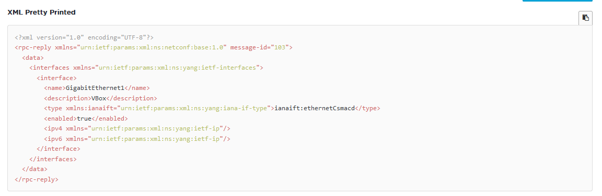
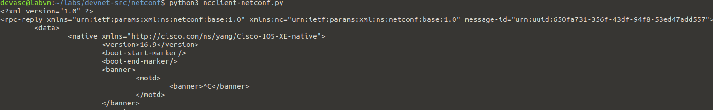
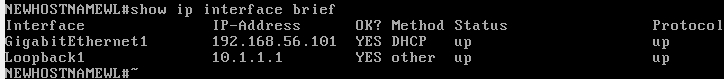
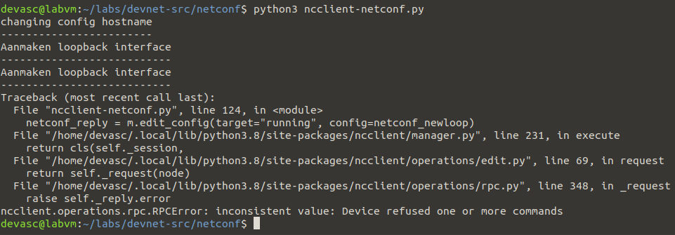
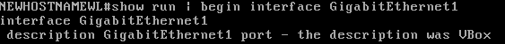
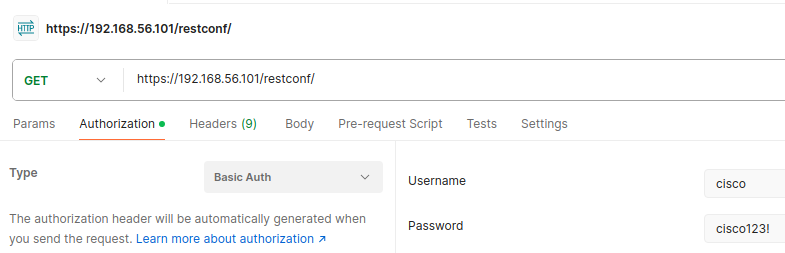
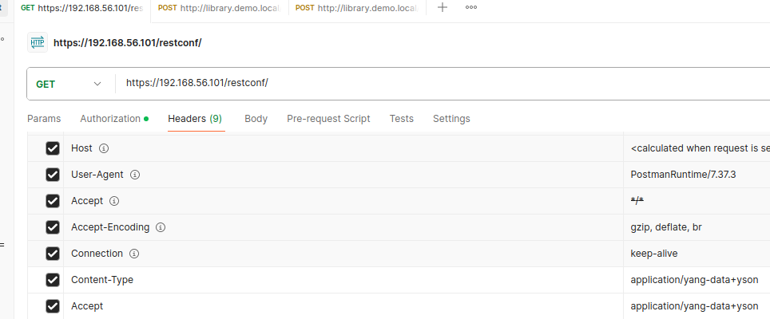

# LAB 7 - YANG, NETCONFIG and RESTCONFIG
## 7.1 Install CRS1000v VM
Cisco DEVNET 7.0.3
### 7.1.1 Install the CRS1000v on VirtualBox
De iso en ova-files werden gedownload. Ik heb de ova geïmporteerd in Virtualbox, daarna heb ik in de eerste cd-rom van CRS1000v VM de iso-file gelaad.

#### Problemen
Ik ben een paar problemen tegengekomen bij de stap om een ip-adres te krijgen van de dhcp-server VirtualBox.

Ik moest "Cable Connect" aanvinken en ik heb ook Promiscuous mode op "allow all" gezet in de internetsettings van de VM. 

Daarna kreeg hij wel een ip-adres.

### 7.1.2 Verify Communications to CRS1000v VM
#### Ping
Ik heb de DEVASC-vm opgestart. Daarna heb ik een ping gedaan naar het adres dat CRS1000v zonet gekregen heeft.

#### SSH

In een terminal heb ik een ssh sessie gestart naar 'CRS1000v'  met als gebruiker 'cisco' en paswoord 'cisco213!'. Na controle dat dat lukte heb ik de sessie beëindigd met 'exit'

#### https
Via een browser op zowel DEVASC als mijn Windows 11 naar 'HTTP://192.168.65.101' gegaan. De waarschuwingen kan je negeren om uiteindelijk op de inlogpagina te komen.

Daarna opnieuw inloggen met login en paswoord om te controleren dat het lukte.

#### Problemen
- De ethernetsettings van DEVASC stonden nog fout doordat ik deze op bridged mode had gezet voor LAB 6

## 7.2 Explore YANG Models
Cisco DEVNET 8.3.5
### Launch DEVASC VM

De vm werd opgestart.

### Explore a YANG Model on github

Via een browser werd een yang-bestand bekeken. Onder de list 'interface' (die in de container 'interfaces' zit) zien we een leaf 'Enabled'. Dit is een boolean.

Ik maak een map aan en daarin download ik m.b.v. wget de yang-file. 

```shell
# controle om te zien of pyang geïnstalleerd is
pyang -v

#indien het niet geïnstalleerd is:
pip3 install pyang --upgrade

```

Met behulp van 'pyang -h | more' krijgen we meer informatie over pyang. We zien dat we met '-f' het formaat kunnen veranderen naar bijvoorbeeld tree. We doen dit op de gedownloade file
 ```shell
 pyang -f tree ietf-interfaces.yang
 ```

 Nu is de file veel duidelijker om te lezen. We vinden veel sneller de leaf 'enabled' terug.

#### Problemen

Ik had niet de raw file gedownload, maar de http-pagina waardoor het commande 'pyang -f tree ietf-interfaces.yang' niet werktte. Na het verwijderen van de foute file en het downloaden van de juiste werkte het wel.

## 7.3 Use NETCONFT to access an IOS XE Device
Cisco DEVNET 8.3.6

### Part 1
Werd reeds gedaan in LAB 7.1

### Part 2

We moeten controleren of de NETCONF SSh daemon gestart is. Dit doen we door op de switch (via ssh) het commando 'show platform software yang-management process' uit te voeren. Dan kunnen we zien of die daemon aan staat. Indien die uit staat:

```shell
conf t
netconf-yang
```

Daarna moeten we de ssh-sessie sluiten omdat we een andere ssh-sessie moeten opstarten naar die daemon.

```shell
ssh cisco@192.168.56.101 -p 830 -s netconf
# 830 = poort
# netconf = subsystem
```

We krijgen dan een hallo-bericht van de andere VM. Dit moeten we beantwoorden met een eigen hallo bericht, anders wordt de sessie beëindigd.
```xml
<hello xmlns="urn:ietf:params:xml:ns:netconf:base:1.0">
<capabilities>
<capability>urn:ietf:params:netconf:base:1.0</capability>
</capabilities>
</hello>
]]>]]>
```
']]>]]>' is het einde van het bericht.

Op de router kunnen we dan m.b.v. 'show netconf-yang sessions' de actieve sessie zien.

We kunnen verschillende dingen doen met deze ssh d.m.v. Remote Procedure Call messages. Wij vragen een xml op met de informatie over de interfaces. Dit doen we met het volgende bericht:
```xml
<rpc message-id="103" xmlns="urn:ietf:params:xml:ns:netconf:base:1.0">
<get>
<filter>
<interfaces xmlns="urn:ietf:params:xml:ns:yang:ietf-interfaces"/>
</filter>
</get>
</rpc>
]]>]]>
```

Daarna krijgen we de xml binnen met op het einde weer die ']]>]]>'. Deze kunnen we online mooier maken met een 'xml prettify'.



Om de sessie te sluiten:
```xml
<rpc message-id="9999999" xmlns="urn:ietf:params:xml:ns:netconf:base:1.0">
<close-session />
</rpc>
```

Op de router zien we dat er geen actieve sessies meer zijn.

### Part 3 - Eerste script
Eerst controleren we of ncclient geïnstalleerd is
```shell
pip3 list --format=columns | grep ncclient
```

We maken een script aan met de volgende code om alle mogelijkheden te zien:
```python
from ncclient import manager
import xml.dom.minidom

m = manager.connect (
    host="192.168.56.101",
    port=830,
    username="cisco",
    password="cisco123!",
    hostkey_verify=False
)

#Hiermee printen we alle mogelijkheden af

print('#Supported Capabilities (YANG models):')
for capability in m.server_capabilities:
    print(capability)
```
We kunnen de laatste 3 regels in commentaar zetten en daarna het scrpt runnen om te zien of de connectie werkt.


### Part 4 - Configuratie ophalen
We zetten de laatste 3 regels in commentaar aangezien we dit nu niet meer nodig hebben. We voegen daarna de volgende code toe:

```python
#hiermee krijgen we de running config
netconf_reply = m.get_config(source = "running")
#Bij deze print heel de xml achter elkaar, zonder nieuwe regels of enters
print(netconf_reply)

#mooier afeprint (import xml.dom.minidom)
print(xml.dom.minidom.parseString(netconf_reply.xml).toprettyxml())
```
Als we het script runnen met enkel de mooie print krijgen we het volgende resultaat:


Nu krijgen we nog alle yang models. We kunnen een filter gebruiken om enkel een specifiek model te krijgen. 'netconf_reply' wordt aangepast om deze filter te gebruiken.
```python
#aanmaken van een variabele filter om een specifiek YANG model te gebruiken.
netconf_filter = """
<filter>
    <native xmlns="http://cisco.com/ns/yang/Cisco-IOS-XE-native" />
</filter>
"""

#hiermee krijgen we de running config
netconf_reply = m.get_config(source = "running", filter = netconf_filter)
```

### Part 5

We kunnen netconf_reply en de prints in commentaar zetten aangezien we die niet meer nodig hebben.

Er wordt een nieuwe variabele aangemaakt om de hostname van de router te veranderen. Daarna wordt deze gebruikt om de configuratie aan te passen met edit_config()
```python
#aanmaken van een config variabele om de configuratie van een apparaat te wijzigen
netconf_hostname = """
<config>
    <native xmlns="http://cisco.com/ns/yang/Cisco-IOS-XE-native">
        <hostname>NEWHOSTNAMEWL</hostname>
    </native>
</config>
"""
#configuratie aanpassen en resultaat mooi printen
netconf_reply = m.edit_config(target="running", config=netconf_hostname)
print(xml.dom.minidom.parseString(netconf_reply.xml).toprettyxml())
```

Het aanmaken van een eerste loopback interface
```python
print("Aanmaken loopback interface")
print("---------------------------")

#aanmaken loopback config variabele
netconf_loopback = """
<config>
    <native xmlns="http://cisco.com/ns/yang/Cisco-IOS-XE-native">
        <interface>
            <Loopback>
                <name>1</name>
                <description>My first NETCONF loopback</description>
                <ip>
                    <address>
                        <primary>
                            <address>10.1.1.1</address>
                            <mask>255.255.255.0</mask>
                        </primary>
                    </address>
                </ip>
            </Loopback>
        </interface>
    </native>
</config>
"""
netconf_reply = m.edit_config(target="running", config=netconf_loopback)
print(xml.dom.minidom.parseString(netconf_reply.xml).toprettyxml())
```
Op de switch zien we nu de nieuwe loopback interface


Nu gaan we een 2e loopback interface aanmaken met hetzelfde ip-adress. We gaan het resultaat niet printen. 
```python
netconf_newloop = """
<config>
    <native xmlns="http://cisco.com/ns/yang/Cisco-IOS-XE-native">
        <interface>
            <Loopback>
                <name>2</name>
                <description>My first second loopback</description>
                <ip>
                    <address>
                        <primary>
                            <address>10.1.1.1</address>
                            <mask>255.255.255.0</mask>
                        </primary>
                    </address>
                </ip>
            </Loopback>
        </interface>
    </native>
</config>
"""

netconf_reply = m.edit_config(target="running", config=netconf_newloop)
print(xml.dom.minidom.parseString(netconf_reply.xml).toprettyxml())
```
Normaal gezien gaan we wel een foutmelding krijgen dat niet alle commando's uitgevoerd kunnen worden. (2 interfaces met hetzelfde ip-adres)



#### Problemen
bij het aanmaken van de 2e loopback interface had ik enkel de description aangepast, niet naam van de interface.

### Part 6 - Pas het script aan

Ik heb besloten om de description van de interface GigabitEthernet1 aan te passen. Ik doe dit met de volgende code:
```python
netconf_changedescription = """
<config>
    <native xmlns="http://cisco.com/ns/yang/Cisco-IOS-XE-native">
        <interface>
            <GigabitEthernet>
                <name>1</name>
                <description>GigabitEthernet1 port - the description was VBox</description>
            </GigabitEthernet>
        </interface>
    </native>
</config>
"""
netconf_reply = m.edit_config(target="running", config=netconf_changedescription)
print(xml.dom.minidom.parseString(netconf_reply.xml).toprettyxml())
```

Na het uitvoeren krijg ik dit resultaat in de running config van de router:


## 7.4 - Use RESTCONF to access an IOS XE Device
Cisco DEVNET 8.3.7

### Part 1 - controle connectie tussen vm's

Reeds gebeurd in 7.3

### Part 2 - Configure IOS XE device for RESTCONF access

Verify RESTCONF daemons are running:
```bash
show platform software yang-management process
```

enable RESTCONF
```bash
conf t
restconf
```
enable & verify HTTPS service
```bash
conf t
ip http secure-server
ip http authentication local
```

Je kan nog eens controleren welke daemons aan moeten staan. Voor RESTCONF moet nginx (de http server) aan staan.

### Part 3 - Open and Configure Postman

Na openen postman SSL cert verification uit zetten
File --> Settings --> General

### Part 4 - Use Postman to Send GET Requests

In het veld naast get de url `https://192.168.56.101/restconf/` invullen. Daarna bij Authorization kiezen voor `basic auth` kiezen en dan login en paswoord invullen.



Daarna moet `headers` aanpassingen gebeuren zodat we de data in json formaat ontvangen.




Het antwoord van de router:
```json
{
    "ietf-restconf:restconf": {
        "data": {},
        "operations": {},
        "yang-library-version": "2016-06-21"
    }
}
```

#### Use GET request to gather information about all interfaces
De tab die we zojuist hebben aangemaakt gaat als template dienen voor andere requests. Daarom maken we eerst een kopie van het tabblad.

In de kopie wordt de url aangepast. Om informatie over de interfaces te ontvangen gebruiken we yet yang-model ietf-interfaces

url: `https://192.168..56.101/restconf/data/ietf-interfaces:interfadces`

het antwoord dat we dan krijgen als we op send klikken:
```json
{
    "ietf-interfaces:interfaces": {
        "interface": [
            {
                "name": "GigabitEthernet1",
                "description": "VBox",
                "type": "iana-if-type:ethernetCsmacd",
                "enabled": true,
                "ietf-ip:ipv4": {},
                "ietf-ip:ipv6": {}
            }
        ]
    }
}
```

Nu gaan we de informatie van een specifieke interface opvragen. Aan de url wordt `interface=GigabitEthernet1` toegevoegd. (Ook nu kan je beter een duplicate maken van de tab)

het resultaat:
```json
{
    "ietf-interfaces:interface": {
        "name": "GigabitEthernet1",
        "description": "VBox",
        "type": "iana-if-type:ethernetCsmacd",
        "enabled": true,
        "ietf-ip:ipv4": {},
        "ietf-ip:ipv6": {}
    }
}
```

Bij ipv4 is er geen ip-adres ingevuld. Dit is omdat de interface een ip-adres krijgt van een DHCP-server. Hetgeen hierboven staat wordt uitgelezen uit de running config.

Nu gaan we op de router hetzelfde ip-adres manueel configureren. Als we dan dezelfde request opnieuw uitvoeren krijgen we wel het ip-adres te zien.

```json
{
    "ietf-interfaces:interface": {
        "name": "GigabitEthernet1",
        "description": "VBox",
        "type": "iana-if-type:ethernetCsmacd",
        "enabled": true,
        "ietf-ip:ipv4": {
            "address": [
                {
                    "ip": "192.168.56.101",
                    "netmask": "255.255.255.0"
                }
            ]
        },
        "ietf-ip:ipv6": {}
    }
}
```

### Part 5 - Use Postman to Send a PUT request

We maken een duplicaat van de laatste tab. We veranderen `get` naar `put`. De interface in de url wordt veranderd naar `Loopback1`

Om te specifiëren wat we aanmaken op de switch moeten we de body veranderen. In het body-tabblad klikken op raw en controleren dat het formaat json is.

De volgende json wordt toegevoegd aan de body:
```json
{
    "ietf-interfaces:interface": {
        "name": "Loopback1",
        "description": "My first RESTCONF loopback",
        "type": "iana-if-type:softwareLoopback",
        "enabled": true,
        "ietf-ip:ipv4": {
            "address": [
                {
                    "ip": "10.1.1.1",
                    "netmask": "255.255.255.0"
                }
            ]
        },
        "ietf-ip:ipv6": {}
    }
}
```

Na het verzenden krijg je een leeg antwoord. Rechts in postman is wel een response code: `201 created`.


Op de router kunnen we controleren op de interface is aangemaakt met 'show ip int brief'.

### Part 6 - Use a Python script to Send GET Requests

Er wordt een script aangemaakt om een get-request te verzenden
```python
import json
import requests
requests.packages.urllib3.disable_warnings()

#url die wordt gebruikt voor de get request
api_url = "https://192.168.56.101/restconf/data/ietf-interfaces:interfaces"


#variabele met de headers van het formaat dat geacepteerd word
headers = { "Accept": "application/yang-data+json",
           "Content-type":"application/yang-data+json"
           
           }
#variabele met login en paswoord
basicauth = ("cisco", "cisco123!")

#variable to send request and store response
resp = requests.get(api_url,auth=basicauth, headers=headers, verify=False)

#de response code wordt afgeprint
print(resp)

#om de inhoud te bekijken in json-formaat
response_json = resp.json()
print(response_json)

#aangezien die uitvoer van de json niet mooi is wordt hetvolgende gedaan
print("Mooie print van json!")
print("---------------------")

print(json.dumps(response_json,indent=4))
```

### Part 7 - Use a Python script to send PUT Requests
Het volgende script werd gemaakt om een PUT request te verzenden:
```python
import json
import requests
requests.packages.urllib3.disable_warnings()

#url die wordt gebruikt voor de get request
api_url = "https://192.168.56.101/restconf/data/ietf-interfaces:interfaces/interface=Loopback2"


#variabele met de headers van het formaat dat geacepteerd word
headers = { "Accept": "application/yang-data+json",
           "Content-type":"application/yang-data+json"
           
           }
#variabele met login en paswoord
basicauth = ("cisco", "cisco123!")

#een python dictionary met de data die de nieuwe interface zal aanmaken
yangConfig = {
    "ietf-interfaces:interface": {
        "name": "Loopback2",
        "description": "My second RESTCONF loopback",
        "type": "iana-if-type:softwareLoopback",
        "enabled": True,
        "ietf-ip:ipv4": {
            "address": [
                {
                    "ip": "10.2.1.1",
                    "netmask": "255.255.255.0"
                }
            ]
        },
        "ietf-ip:ipv6": {}
        }
}

#a variable to send te put request and store the response
resp = requests.put(api_url,data=json.dumps(yangConfig), auth=basicauth,headers=headers,verify=False)

#er wordt getest of de ressponse code goed is. Dan wordt het antwooord normaal afgeprint. Anders als error bericht.
if(resp.status_code >= 200 and resp.status_code <= 299) :
    print("STATUS OK: {}".format(resp.status_code))
else:
    print("ERROR. STATUS Code: {} \nError Message: {}".format(resp.status_code,resp.json()))
```